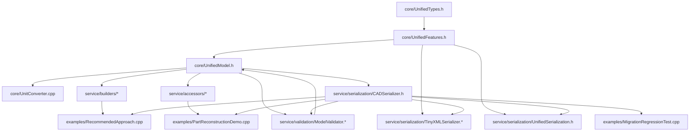

# CADExchange 代码结构说明（基于当前源码）

> 说明：本文仅基于 `E:\MyProject\CADExchange` 当前代码与目录，不基于历史设计假设。  
> 术语与代码一致：`UnifiedModel`、`Builder`、`Accessor`、`SweepExtent`、`SaveModel/LoadModel` 等。

## 0. 跨模块统一术语与口径（本轮收敛）

- **FeatureType**：统一指 `CADExchange::FeatureType`（`Sketch/Extrude/Revolve/DatumPlane`）；各 CAD 侧类型先映射到该枚举后再进入流程。  
- **Extent（SweepExtent）**：统一按 `Type + Value + Offset + Reference` 描述终止条件。  
- **Reference**：统一指 `CRef*` 引用实体（标准基准/拓扑几何/草图段），Read 与 Write 均按 `RefType + 几何指纹` 落地。  
- **ThinWall**：统一指薄壁选项（`HasThinWall + Thickness + Side/Direction`）。  
- **Flip**：统一区分方向翻转（`Flip`）与材料侧翻转（`FlipMaterialSide`）。  
- **Read / Write 表述风格**：  
  - **Read**：`CAD 原生模型 -> UnifiedModel -> tinyxml/json（可选 geometry sidecar）`  
  - **Write**：`json/tinyxml -> UnifiedModel -> CAD 原生重建`

---

## 1. 代码分层与模块边界

### 1.1 分层概览（从下到上）

1. **thirdParty 层**  
   - 提供外部依赖：`tinyxml2`、`cereal`、`cadex_logger.h`。  
   - 不承载 CADExchange 业务规则。

2. **core 层（统一数据模型层）**  
   - 定义统一几何/特征/模型数据结构：`UnifiedTypes.h`、`UnifiedFeatures.h`、`UnifiedModel.h`。  
   - 提供单位转换：`UnitConverter.cpp`。  
   - 不依赖 serialization/validation 的实现细节（`UnifiedModel::Validate()` 在 `.cpp` 中委托）。

3. **service 层（业务服务层）**  
   - **builders/**：写路径（构造 `UnifiedModel`）。  
   - **accessors/**：读路径（只读访问已构建模型）。  
   - **serialization/**：模型与 XML（TinyXML/cereal）互转。  
   - **validation/**：统一规则校验。  
   - **geometry/**：几何采集与 JSON 导出基类。

4. **examples 层（示例/回归）**  
   - 演示构建、访问、序列化与回归测试流程。

### 1.2 模块边界（当前实现）

- `core` 是中心数据边界，`service/*` 都直接依赖它。  
- `builders` 与 `accessors` 共享 `core` 类型，不互相依赖（仅通过模型数据间接协作）。  
- `validation` 通过 `ModelValidator::Validate()` 承接 `UnifiedModel::Validate()`。  
- `serialization` 既依赖 `core`，又在 `SaveModel/LoadModel` 中调用 `Validate()`，因此与 `validation` 形成运行时耦合。  
- `examples` 可以直接跨用 `builders/accessors/serialization`，是“集成演示层”，不是稳定 API 边界。

---

## 2. 目录与文件职责（尽量到文件级）

## 2.1 根目录

- `CMakeLists.txt`：构建入口，定义静态库 `cadexchange` 与 3 个示例可执行程序。  
- `README.md`：项目说明（当前与实际目录存在偏差，见问题点）。  
- `CODE_IMPROVEMENT_PLAN.md`：改进规划文档（非编译输入）。  
- `RecommendedApproach_Output.xml`：示例输出 XML（产物示例）。

## 2.2 core

- `core/UnifiedTypes.h`：基础几何类型、单位、标准基准 ID、向量运算工具。  
- `core/UnifiedFeatures.h`：统一特征树与引用体系（`CSketch/CExtrude/CRevolve/CDatumPlane`、`SweepExtent` 等）。  
- `core/UnifiedModel.h`：`UnifiedModel` 容器、索引、查找、校验入口声明。  
- `core/UnitConverter.cpp`：`ConvertModelUnit` 及特征/引用的单位缩放实现。  
- `core/TypeAdapters.h`：`PointAdapter/VectorAdapter` 与反向 `PointWriter/VectorWriter`。  
- `core/bridge/BridgeCommon.h`：桥接通用工具（ScopeExit、JSON 辅助、验证 JSON 输出）。

## 2.3 service/builders

- `BuilderMacros.h`：点/向量 setter 宏。  
- `FeatureBuilderBase.h`：所有 Builder 基类（生命周期、`Build()`、引用校验）。  
- `ReferenceBuilder.h`：`Ref::*` 引用构造体系（面/边/点/基准面/轴/草图段）。  
- `SketchBuilder.h`：草图构造（段、约束、CSys、参考面）。  
- `EndConditionBuilder.h`：`Extent`/`EndCondition` 工厂与辅助构造。  
- `ExtrudeBuilder.h`：拉伸构造（轮廓、方向、`extent1/extent2`、薄壁、拔模）。  
- `RevolveBuilder.h`：旋转构造（轮廓、轴、`extent1/extent2`、薄壁）。  
- `DatumPlaneBuilder.h`：基准面构造（方法、引用、约束）。  
- `FeatureBuilders.h`：Builder 聚合头。  
- `StringHelper.h`：UUID（递增串）与 UTF8/宽字串路径处理。  

## 2.4 service/accessors

- `AccessorMacros.h`：Accessor getter 宏。  
- `FeatureAccessorBase.h`：特征访问器基类、`As<T>()` 转换。  
- `ReferenceAccessor.h`：统一引用只读访问（按类型提取几何指纹）。  
- `SketchAccessor.h`：草图/草图段访问。  
- `ExtrudeAccessor.h`：拉伸访问（共享 `SweepExtent` 字段读取）。  
- `RevolveAccessor.h`：旋转访问（共享 `SweepExtent` 字段读取）。  
- `DatumPlaneAccessor.h`：基准面访问。  
- `ModelAccessor.h`：模型访问入口（按索引/ID 取特征）。  
- `FeatureAccessors.h`：Accessor 聚合头。  
- `todo.md`：历史设计草稿（非编译代码）。

## 2.5 service/serialization

- `CADSerializer.h`：`SaveModel/LoadModel` 总入口（格式分派 + 校验接入）。  
- `TinyXMLSerializer.h/.cpp`：TinyXML 读写实现（主 XML 路径）。  
- `UnifiedSerialization.h`：cereal 序列化规则（模板化）。  
- `SerializationRegistry.cpp`：cereal 多态注册。  
- `FeatureFormatter.h`：单特征 JSON 输出辅助（基于 cereal）。

## 2.6 service/validation

- `ModelValidator.h/.cpp`：模型规则校验实现（RuleID 输出、error/warning 分层）。

## 2.7 service/geometry

- `GeometryCollectorBase.h`：CRTP 采集基类；导出边/基准面 JSON。

## 2.8 examples

- `examples/RecommendedApproach.cpp`：推荐构建路径演示（Builder + SaveModel）。  
- `examples/PartReconstructionDemo.cpp`：加载/遍历/提取/依赖分析/重建模拟演示。  
- `examples/MigrationRegressionTest.cpp`：旋转特征迁移回归测试（尤其 `SweepExtent` 语义）。

## 2.9 thirdParty

- `thirdParty/tinyxml2/`：XML DOM 依赖。  
- `thirdParty/cereal/`：模板序列化依赖。  
- `thirdParty/cadex_logger.h`：日志宏与轻量 logger。

---

## 3. 核心类与核心函数职责（按文件）

> 规则：每个文件列“核心函数详列”；其余函数按功能分组汇总。

### 3.1 core

### `core/UnifiedTypes.h`
- **核心类型**
  - `CPoint3D`、`CVector3D`：几何基础类型。
  - `StandardID`：标准基准平面/轴/原点的统一标识。
- **核心函数详列**
  - `CVector3D::Normalize()`：向量归一化。
  - `CVector3D::Cross()/Dot()/IsParallel()`：向量运算与平行性判定。
  - `StandardID::MatchPlane()/MatchAxis()`：方向到标准基准 ID 的映射。
  - `CSketchCSys::IsValid()`：草图局部坐标系合法性校验。
- **其他函数分组**
  - 角度转换：`GeoUtils::DegreesToRadians/RadiansToDegrees`。
  - 全局运算符：`Cross/Dot/IsParallel` 包装；点加减运算符。
  - 标准 ID 判断：`IsStandardPlane/IsStandardAxis/IsStandardPoint`。

### `core/UnifiedFeatures.h`
- **核心类型**
  - 引用体系：`CRefEntityBase` 及 `CRefPlane/CRefFace/CRefEdge/...`。
  - 草图体系：`CSketchSeg` 及 `CSketchLine/Circle/Arc/Point`。
  - 特征体系：`CFeatureBase`、`CSketch`、`CExtrude`、`CRevolve`、`CDatumPlane`。
  - 共享终止语义：`SweepExtent`（Extrude/Revolve 共用）。
- **核心函数详列**
  - 本文件以数据结构为主，核心逻辑主要在构造函数（设置 `featureType`）与字段语义约束（如 `SweepExtent`、`ThinWallOption`）。
- **其他函数分组**
  - 枚举定义：`FeatureType/RefType/PlaneMethod/PlaneConstraintType`。
  - 约束与选项结构：`DraftOption/ThinWallOption/PlaneConstraint`。

### `core/UnifiedModel.h`
- **核心类**
  - `UnifiedModel`
- **核心函数详列**
  - `AddFeature()`：加入特征并更新 `m_index`（ID 索引）。
  - `GetFeature()`：按 ID 取特征。
  - `GetFeatureIdByName()`：按名称找 ID（线性扫描）。
  - `GetFeatureIndexByID()`：按 ID 找顺序。
  - `Validate()`：模型校验入口（在 `ModelValidator.cpp` 委托实现）。
- **其他函数分组**
  - 类型安全读取：`GetFeatureAs<T>()`。
  - 容器访问/遍历：`GetFeatures()`、`ForEachMutable()`、`Features()`（deprecated）。
  - 生命周期：`Clear()`。
  - 单位转换声明：`ConvertModelUnit(...)`。

### `core/UnitConverter.cpp`
- **核心函数详列**
  - `ConvertModelUnit(UnifiedModel&, UnitType, std::string*)`：统一单位转换入口，按特征类型递归缩放。
- **其他函数分组**
  - 单位解析：`IsSupportedUnitForConversion`、`TryGetMeterScale`、`UnitTypeToString`。
  - 缩放子流程：`ScaleRefEntity`、`ScaleSketch`、`ScaleExtrude`、`ScaleRevolve`、`ScaleDatumPlane`、`ScaleSweepExtent`。
  - 基础缩放：`ScalePoint`。

### `core/TypeAdapters.h`
- **核心函数详列**
  - `PointAdapter<T>::Convert(...)` / `VectorAdapter<T>::Convert(...)`：外部类型 → 内部类型。
  - `PointWriter<T>::Convert(...)` / `VectorWriter<T>::Convert(...)`：内部类型 → 外部类型。
- **其他函数分组**
  - 特化组：`CPoint3D/CVector3D` 特化、`std::array<T,3>` 与 `T[3]` 特化。

### `core/bridge/BridgeCommon.h`
- **核心函数详列**
  - `AppendValidationJson(std::wofstream&, const ValidationReport&)`：将校验结果写成标准 JSON 片段。
  - `TryGetJsonStringValue(...)`：简单 JSON 键值提取（字符串值）。
- **其他函数分组**
  - RAII：`ScopeExit`、`MakeScopeExit`。
  - 路径/字符串：`ReplaceExtension`、`JsonEscape`。

---

### 3.2 service/builders

### `service/builders/BuilderMacros.h`
- **核心函数详列**
  - 宏 `BUILDER_ADD_POINT_SETTER`：生成点 setter（`x,y,z` + 模板）。
  - 宏 `BUILDER_ADD_VECTOR_SETTER`：生成向量 setter（`x,y,z` + 模板）。
- **其他函数分组**
  - 无。

### `service/builders/FeatureBuilderBase.h`
- **核心类**
  - `template<class T> FeatureBuilderBase`
- **核心函数详列**
  - 构造函数：创建 `m_feature`、分配 `featureID`、设置 `featureName`。
  - `Build()`：把构建对象写入 `UnifiedModel` 并返回 ID。
  - `ValidateReference(...)`：校验 plane/axis/point 引用是否可解析到已存在特征或标准基准。
- **其他函数分组**
  - 状态设置：`SetSuppressed()`。
  - 访问器：`GetModel()`、`GetFeature()`。

### `service/builders/ReferenceBuilder.h`
- **核心类**
  - `RefFaceBuilder/RefEdgeBuilder/RefVertexBuilder/RefPlaneBuilder/RefAxisBuilder/RefPointBuilder/RefSketchBuilder/RefSketchSegBuilder`
  - 静态门面 `Ref`
- **核心函数详列**
  - `Ref::Face/Edge/Vertex/Plane/Axis/Point/Sketch/SketchSegment`：统一引用构造入口。
  - `Ref::XY/YZ/ZX`：内置标准平面引用工厂。
  - 名称解析重载：`Ref::Plane(model,name)` 等，内部通过 `GetFeatureIdByName`。
- **其他函数分组**
  - 各 Builder 的几何字段 setter（`Origin/Normal/StartPoint/...`）。
  - 各 Builder 的 `Build()` 与 `operator std::shared_ptr<...>()`。

### `service/builders/SketchBuilder.h`
- **核心类**
  - `SketchBuilder`
- **核心函数详列**
  - `SetReferencePlane(...)`：设置草图参考实体并校验。
  - `SetCSys(...)`：设置局部坐标系并强制 `IsValid()`。
  - `AddLine/AddCircle/AddArc/AddPoint`：添加几何段并返回 localID。
  - `AddCoincident/AddHorizontal/AddVertical/AddTangent/AddDistanceDimension`：添加约束。
- **其他函数分组**
  - 约束内部实现：`AddConstraint(...)`。
  - LocalID 生成：`GenerateLocalID(...)`。

### `service/builders/EndConditionBuilder.h`
- **核心类**
  - `Extent`、`EndCondition`、`EndConditionHelper`
- **核心函数详列**
  - `Extent::Value/Symmetric/ThroughAll/UpToEntity/...`：构造 `SweepExtent`。
  - `EndCondition::*`：语义化别名（面向 Extrude）。
  - `EndConditionHelper::UpToVertex/UpToFace/UpToRefPlane`：从参数快速拼装引用+终止条件。
- **其他函数分组**
  - 兼容转换：`EndConditionHelper::SafeConvert`。

### `service/builders/ExtrudeBuilder.h`
- **核心类**
  - `ExtrudeBuilder`
- **核心函数详列**
  - `SetProfile()/SetProfileByName()`：指定轮廓草图。
  - `SetDirection(...)`：设置并归一化方向向量。
  - `SetEndCondition1/SetEndCondition2`：设置 `extent1/extent2`，并校验引用。
  - `SetThinWall()/SetThinWallOffsets()`：薄壁参数写入。
  - `SetDraft(...)`：拔模参数写入。
- **其他函数分组**
  - 布尔操作：`SetOperation(...)`。

### `service/builders/RevolveBuilder.h`
- **核心类**
  - `RevolveBuilder`
- **核心函数详列**
  - `SetProfile(...)`：设置轮廓草图。
  - `SetAxisExplicit(...)` / `SetAxisRef(...)` / `SetAxisFromSketchLine(...)`：轴定义路径。
  - `SetExtent1/SetExtent2` 与 `SetAngle/SetTwoWayAngle/SetSymmetricAngle`：范围定义。
  - `SetThinWall()/SetThinWallOffsets()`：薄壁参数写入。
- **其他函数分组**
  - 布尔操作：`SetOperation(...)`。

### `service/builders/DatumPlaneBuilder.h`
- **核心类**
  - `PlaneConstraintBuilder`、`DatumPlaneBuilder`
- **核心函数详列**
  - `SetMethod()/SetLineMethod()`：设置构造方法。
  - `AddReference()/SetReferences()/AddReferenceAndGetIndex()`：管理引用实体。
  - `AddConstraint(...)`（两组重载）：约束写入并校验索引合法性。
  - `AddReferenceWithConstraint(...)`：引用与约束一体化添加。
- **其他函数分组**
  - 清理：`ClearConstraints()/ClearReferences()`。
  - 内部转换：`ToReference(...)`、`AddReferenceRaw(...)`。

### `service/builders/StringHelper.h`
- **核心函数详列**
  - `GenerateUUID()`：生成 `FB-<N>` 递增 ID。
  - `ToUtf8(...)` / `ToWide(...)`：UTF8 与宽字串互转。
  - `CleanPath(...)`：清理 `file://` 前缀。
- **其他函数分组**
  - `ToUtf8` 重载（`const wchar_t*`、`wchar_t*`）。

### `service/builders/FeatureBuilders.h`
- **核心函数详列**
  - 无（聚合头）。
- **其他函数分组**
  - 汇总 include。

### 3.3 service/accessors

### `service/accessors/AccessorMacros.h`
- **核心函数详列**
  - 宏 `ACCESSOR_GETTER`、`ACCESSOR_REF_GETTER`、`ACCESSOR_OPTIONAL_GETTER`、`ACCESSOR_HAS_GETTER`、`ACCESSOR_IS_GETTER`。
- **其他函数分组**
  - 无。

### `service/accessors/FeatureAccessorBase.h`
- **核心类**
  - `FeatureAccessorBase`
- **核心函数详列**
  - `As<AccessorT>()`：尝试转换为具体访问器。
  - `GetFeatureType()/GetID()/GetName()/IsSuppressed()`：通用特征读取。
  - `IsType<FeatureT>()`：底层特征类型判断。
- **其他函数分组**
  - 指针访问：`Data()`、`operator->()`、`GetRaw()`。

### `service/accessors/ReferenceAccessor.h`
- **核心类**
  - `ReferenceAccessor`
- **核心函数详列**
  - 类型/标识：`GetRefType()`、`GetParentFeatureID()`、`GetTargetFeatureID()`、`GetTopologyIndex()`、`GetSketchSegmentLocalID()`。
  - 标准基准判断：`IsStandard()`。
  - 几何读取：`GetFace*`、`GetEdge*`、`GetVertexPosition`、`GetPlane*`、`GetAxis*`、`GetPointPosition`。
- **其他函数分组**
  - 泛型输出重载（模板版本）。
  - 原始指针与类型提取：`Data()/GetRaw()/GetAs<T>()`。

### `service/accessors/SketchAccessor.h`
- **核心类**
  - `SketchSegmentAccessor`、`SketchAccessor`
- **核心函数详列**
  - 段读取：`GetSegmentCount()`、`GetSegment(index)`、`GetSegmentByLocalID(...)`。
  - 坐标系读取：`GetCSys(...)`（含模板重载）。
  - 参考面读取：`GetReferencePlane()`、`HasReferencePlane()`。
  - 约束读取：`GetConstraintCount()`、`GetConstraint(...)`。
  - 段细节读取：`GetLineCoords/GetCircleParams/GetArcParams/GetPointCoord`。
- **其他函数分组**
  - 访问增强：`SketchSegmentAccessor::As<T>()`。

### `service/accessors/ExtrudeAccessor.h`
- **核心类**
  - `ExtrudeAccessor`
- **核心函数详列**
  - 轮廓/方向/操作：`GetProfileSketchID()`、`GetDirection()`、`GetOperation()`。
  - 方向1读取：`GetEndType1/GetDepth1/GetOffset1/HasOffset1/IsFlip1/IsFlipMaterialSide1/GetReference1`。
  - 方向2读取：`HasDirection2` + 对应 `Get*2` 系列与 `GetReference2`。
  - 可选参数：`HasDraft/GetDraftAngle/IsDraftOutward`，`HasThinWall/GetThinWallThickness/...`。
- **其他函数分组**
  - 类型适配输出：`GetDirectionAs<VectorT>()`。

### `service/accessors/RevolveAccessor.h`
- **核心类**
  - `RevolveAccessor`
- **核心函数详列**
  - 轮廓/操作：`GetProfileSketchID()`、`GetOperation()`。
  - 轴读取：`GetAxisOrigin()`、`GetAxisDirection()`、`GetAxisReference()`、`GetAxisReferenceLocalID()`。
  - 范围读取：`GetExtentType1/Value1/Offset1/...` 与 extent2 对应函数。
  - 薄壁读取：`HasThinWall/GetThinWallThickness/...`。
- **其他函数分组**
  - 无（接口集中在核心读取）。

### `service/accessors/DatumPlaneAccessor.h`
- **核心类**
  - `DatumPlaneAccessor`
- **核心函数详列**
  - 方法读取：`GetMethod()`、`IsLineMethod()`。
  - 约束读取：`HasConstraints/GetConstraintCount/GetConstraint/GetConstraints`。
  - 引用读取：`HasReferences/GetReferenceCount/GetReference/GetReferenceEntities`。
- **其他函数分组**
  - 无。

### `service/accessors/ModelAccessor.h`
- **核心类**
  - `ModelAccessor`
- **核心函数详列**
  - `SetModel(...)`：注入模型。
  - `GetFeatureCount()/GetFeature(index)/GetFeatureByID(...)`：模型级检索。
  - `GetAllFeatures()`：扁平遍历入口。
- **其他函数分组**
  - 模型可用性与原始访问：`IsValid()`、`GetRawModel()`、`Data()`。

### `service/accessors/FeatureAccessors.h`
- **核心函数详列**
  - 无（聚合头）。
- **其他函数分组**
  - 汇总 include。

### `service/accessors/todo.md`
- **核心函数详列**
  - 无（历史设计草稿文档，非编译输入）。
- **其他函数分组**
  - 记录旧方案与迁移说明。

---

### 3.4 service/serialization

### `service/serialization/CADSerializer.h`
- **核心函数详列**
  - `SaveModel(...)`：
    1) 默认先 `model.Validate()`；  
    2) 有 error 则阻断保存；warning 输出 stderr；  
    3) `SerializationFormat::TINYXML` 走 `TinyXMLSerializer::Save`；  
    4) `SerializationFormat::CEREAL`（启用宏时）走 cereal `save(...)`。
  - `LoadModel(...)`：
    1) 按格式加载；  
    2) 加载后统一 `model.Validate()`；  
    3) error 则返回 false，warning 输出 stderr。
- **其他函数分组**
  - 类型定义：`SerializationFormat`。
  - 注册入口声明：`RegisterSerializationTypes()`。

### `service/serialization/TinyXMLSerializer.h`
- **核心函数详列**
  - 顶层 API：`Save(...)`、`Load(...)`。
  - Feature 级：`SaveFeature/LoadFeature`、`SaveSketch/LoadSketch`、`SaveExtrude/LoadExtrude`、`SaveRevolve/LoadRevolve`、`SaveDatumPlane/LoadDatumPlane`。
  - 公共元素：`SaveRefEntity/LoadRefEntity`、`SavePoint3D/LoadPoint3D`、`SaveVector3D/LoadVector3D`。
- **其他函数分组**
  - 草图段与约束：`SaveSketchSeg/LoadSketchSeg`、`SaveConstraint/LoadConstraint`。

### `service/serialization/TinyXMLSerializer.cpp`
- **核心函数详列**
  - `TinyXMLSerializer::Save(...)`：构建 `<UnifiedModel>` 根节点，写 `UnitSystem/ModelName/FeatureCount/SchemaVersion`，循环 `SaveFeature`。
  - `SaveFeature(...)`：按 `FeatureType` 分派到具体保存函数。
  - `SaveExtrude(...)` / `SaveRevolve(...)`：统一写 `Extent1/Extent2`（`Type/Value/Offset/HasOffset/Flip/FlipMaterialSide/ReferenceEntity/HelperPoint`）。
  - `TinyXMLSerializer::Load(...)`：解析根节点，读取 unit/modelName，循环 `LoadFeature` 后 `AddFeature`。
  - `LoadFeature(...)`：按 `Type` 分派到具体加载函数，并做 ID 严格检查。
  - `LoadExtrude(...)` / `LoadRevolve(...)`：读取 `Extent1/Extent2`，兼容 `EndCondition1/2` 与 `Depth` 旧字段。
  - `SaveRefEntity(...)` / `LoadRefEntity(...)`：基于 `RefType` 注册表的统一引用编码/解码。
- **其他函数分组**
  - 枚举与字符串映射：`UnitTypeToString/FromString`、`BooleanOpToString/FromString`、`SweepExtentTypeToString/FromString`、`PlaneMethod*`、`PlaneConstraintType*`、`ConstraintType*`。
  - 三元组处理：`FormatTriple`、`TryParseTriple`、`ParsePointAttribute`、`ParseVectorAttribute`。
  - 引用注册表：`RefSerializerEntry` + `kRefSerializerEntries` + `FindRefEntry*` + `RefTypeToString/FromString`。

### `service/serialization/UnifiedSerialization.h`
- **核心函数详列**
  - `serialize(...)` 系列：覆盖 `CPoint3D/CVector3D`、引用类型、草图类型、特征类型、`SweepExtent`、`PlaneConstraint` 等。
  - `save(Archive&, const UnifiedModel&)`：写 Unit/Name/FeatureCount + 扁平 Feature。
  - `load(Archive&, UnifiedModel&)`：读 Unit/Name/FeatureCount，`Clear()` 后循环 `AddFeature(...)`。
- **其他函数分组**
  - 多态基类序列化：`CRefEntityBase`、`CFeatureBase`、`CSketchSeg`。
  - 扩展数据：`ThinWallOption`、`CGeoDatumPlane` 等。

### `service/serialization/SerializationRegistry.cpp`
- **核心函数详列**
  - `CEREAL_REGISTER_TYPE`、`CEREAL_REGISTER_POLYMORPHIC_RELATION`：注册引用/草图段/特征多态关系。
- **其他函数分组**
  - `RegisterSerializationTypes()` 当前为空函数体（仅触发编译单元链接）。

### `service/serialization/FeatureFormatter.h`
- **核心函数详列**
  - `FeatureFormatter::ToJson(...)`：将单特征序列化为 JSON 字符串（cereal JSON archive）。
- **其他函数分组**
  - 异常包装（返回 `{"error":"..."}`）。

---

### 3.5 service/validation

### `service/validation/ModelValidator.h`
- **核心函数详列**
  - `ModelValidator::Validate(const UnifiedModel&)` 声明。
- **其他函数分组**
  - 无。

### `service/validation/ModelValidator.cpp`
- **核心函数详列**
  - `UnifiedModel::Validate()`：委托到 `ModelValidator::Validate(...)`。
  - `ModelValidator::Validate(...)`：
    - 预扫描引用草图；
    - 主循环按特征类型校验；
    - 通过 `addError/addWarn` 写 RuleID；
    - 使用 `checkExtent(...)` 统一校验 `SweepExtent`。
- **其他函数分组**
  - 辅助：`IsBuiltinStandardDatumID`、`toMeter`、`isZeroVec`、`vecLen`。

---

### 3.6 service/geometry

### `service/geometry/GeometryCollectorBase.h`
- **核心类**
  - `template<class Derived, class EdgeT> GeometryCollectorBase`
- **核心函数详列**
  - `Collect(...)`：清空容器后调用派生类 `CollectImpl(...)`。
  - `SaveEdgesToJson(...)`：导出边与辅助基准面为 JSON。
  - 只读访问：`GetEdges()/GetDatumPlanes()/EdgeCount()/DatumPlaneCount()`。
- **其他函数分组**
  - 派生类写入口：`AddEdge(...)`、`AddDatumPlane(...)`。
  - JSON 工具：`EscapeJson`、`FormatPoint`、`FormatVector`、`CurveTypeToString`、`FormatNumber`。

---

### 3.7 examples

### `examples/RecommendedApproach.cpp`
- **核心函数详列**
  - `BuildBaseSketch(...)`、`BuildExtrudeFeature(...)`、`BuildRevolveProfileSketch(...)`：构建示例特征。
  - `DemoImprovedExtrudeBuilder(...)`：展示 `SetProfileByName`、`EndConditionHelper` 等用法。
  - `main(...)`：组合构建并调用 `SaveModel(..., SerializationFormat::TINYXML)`。
- **其他函数分组**
  - 输出辅助：`PrintResult(...)`。
  - 草图创建辅助：`CreateFaceCenteredSketch(...)`。

### `examples/PartReconstructionDemo.cpp`
- **核心函数详列**
  - `LoadAndDisplayModelInfo(...)`：读取 XML 并展示模型概览。
  - `TraverseAndDisplayFeatures(...)`：遍历并分类输出特征。
  - `ExtractSketchData(...)`：读取草图段/参考面/约束。
  - `ExtractExtrudeData(...)`：读取拉伸参数与引用实体。
  - `AnalyzeDependencies(...)`：构建依赖图并尝试拓扑排序。
  - `SimulatePartReconstruction(...)`：按特征类型模拟重建步骤。
  - `main(...)`：按“加载→遍历→提取→依赖→重建”串联流程。
- **其他函数分组**
  - 输出与格式化：`PrintSeparator/PrintSubseparator/FormatNumber`。
  - `SweepExtent` 展示：`SweepExtentTypeLabel`、`DescribeExtentSummary`、`PrintExtentDetails`。

### `examples/MigrationRegressionTest.cpp`
- **核心函数详列**
  - `TestRevolveBuilderIgnoresUnknownExtent()`：验证 UNKNOWN extent 不覆盖有效配置。
  - `TestRevolveAccessorExposesSharedExtentFields()`：验证 Revolve Accessor 能读取共享范围字段。
  - `TestLegacyRevolveXmlRejected()`：验证旧 XML（无 Extent1）被拒绝。
  - `TestRevolveSketchAxisSerializesReferenceEntity()`：验证旋转轴草图段引用可序列化/反序列化保持。
  - `main(...)`：执行测试并输出 `[PASS]`。
- **其他函数分组**
  - 断言辅助：`Fail`、`Expect`、`MakeSketch`。

---

### 3.8 thirdParty

### `thirdParty/cadex_logger.h`
- **核心函数详列**
  - `cadex::Logger::DoLog(...)`：统一日志格式与输出。
  - `SetLevel(...)`、`SetFile(...)`：日志配置。
- **其他函数分组**
  - 宏：`LOG_DEBUG/INFO/WARN/ERROR`。
  - 辅助：`cadex::WN(...)`。

### `thirdParty/tinyxml2/*` 与 `thirdParty/cereal/*`
- **核心函数详列**
  - 外部库源码（vendor），由 CADExchange 调用，不在本仓自定义语义层。
- **其他函数分组**
  - `tinyxml2`：DOM 读写。
  - `cereal`：模板序列化与多态支持。

---

## 4. Read/Write 工作流（统一口径）

## 4.1 Write 工作流（Builder -> Validate -> SaveModel）

1. 创建 `UnifiedModel model(unit, name)`。  
2. 通过 `SketchBuilder/ExtrudeBuilder/RevolveBuilder/DatumPlaneBuilder` 写入特征参数。  
3. 每个 Builder 最后调用 `Build()`，由 `FeatureBuilderBase::Build()` 调用 `UnifiedModel::AddFeature()`。  
4. 引用类参数通过 `Ref::*` 构建；`FeatureBuilderBase::ValidateReference()` 在写入前检查引用可达性（标准基准除外）。

## 4.2 Write 校验门（Validate）

1. 调用 `UnifiedModel::Validate()`。  
2. `UnifiedModel::Validate()` 委托到 `ModelValidator::Validate()`。  
3. `ModelValidator` 生成 `ValidationReport`：
   - `errors`：阻断错误（如空/重复 ID、非法 `SweepExtent`、缺失草图引用等）；  
   - `warnings`：可继续但需关注（如单位量级异常、引用顺序问题、方向未归一化等）。

## 4.3 Write 落盘（SaveModel）

`SaveModel(model, path, err, format, skipValidation)`：

1. 若 `skipValidation=false`：先 `Validate()`。  
2. 有 `errors`：直接失败并写 `errorMessage`。  
3. 有 `warnings`：写 stderr，不阻断。  
4. 分派：
   - `TINYXML`：`TinyXMLSerializer::Save()`；
   - `CEREAL`（宏启用时）：`RegisterSerializationTypes()` + `cereal::XMLOutputArchive` + `save(...)`。

## 4.4 Read 工作流（LoadModel -> Validate -> Accessor）

`LoadModel(model, path, err, format)`：

1. 先按 `format` 读取（TinyXML 或 cereal）。  
2. 读取成功后统一再 `Validate()`。  
3. 若校验失败，返回 false 并写出错误；warning 仍输出 stderr。  
4. 成功后可用 `Accessor` 层读取业务字段。

---

## 5. 依赖关系

## 5.1 内部依赖图（简化）

## 5.2 外部依赖

- **tinyxml2**  
  - 使用位置：`service/serialization/TinyXMLSerializer.h/.cpp`。  
  - 职责：XML DOM 读写。

- **cereal**  
  - 使用位置：`UnifiedSerialization.h`、`SerializationRegistry.cpp`、`FeatureFormatter.h`、`CADSerializer.h`。  
  - 职责：多态对象序列化（XML/JSON）；受 `ENABLE_CEREAL_SERIALIZATION` 控制。

- **STL**  
  - 全局使用：`vector/string/optional/shared_ptr/unordered_map/filesystem/...`。  
  - 关键用途：容器建模、I/O、字符串处理、算法。

- **CMake**  
  - 使用位置：`CADExchange/CMakeLists.txt`。  
  - 职责：构建 `cadexchange` 静态库与示例程序；链接 tinyxml2 源文件。

---

## 6. 当前问题点（重复/耦合/抽象不合理）

1. **序列化实现过于集中（God File）**  
   - 文件：`service/serialization/TinyXMLSerializer.cpp`  
   - 符号：`TinyXMLSerializer::Save*`、`Load*`、`kRefSerializerEntries`、大量 `*ToString/*FromString`  
   - 问题：1 个文件承载枚举映射、引用表、特征编码、兼容逻辑，修改风险面大。

2. **Extrude/Revolve 在 Builder 与 Accessor 中重复薄壁与范围逻辑**  
   - 文件：`service/builders/ExtrudeBuilder.h`、`service/builders/RevolveBuilder.h`、`service/accessors/ExtrudeAccessor.h`、`service/accessors/RevolveAccessor.h`  
   - 符号：`SetThinWall/SetThinWallOffsets`、`GetThinWallThickness` 及 `extent*` 读取逻辑  
   - 问题：同类规则重复实现，行为一致性依赖人工同步。

3. **名称查找是 O(n)，与 Builder 的 name API 高频耦合**  
   - 文件：`core/UnifiedModel.h`、`service/builders/ExtrudeBuilder.h`、`service/builders/ReferenceBuilder.h`  
   - 符号：`UnifiedModel::GetFeatureIdByName`、`ExtrudeBuilder::SetProfileByName`、`Ref::Plane/Axis/Point/Sketch(model,name)`  
   - 问题：模型增大时检索退化明显。

4. **校验与引用可达性规则分散**  
   - 文件：`service/builders/FeatureBuilderBase.h`、`service/validation/ModelValidator.cpp`  
   - 符号：`ValidateReference`、`ModelValidator::Validate`  
   - 问题：写时校验与全局校验规则不在同一策略中心，容易出现“局部通过、全局失败”的规则漂移。

5. **构建配置与目录现状有不一致风险**  
   - 文件：`CMakeLists.txt`、`README.md`  
   - 符号：`include/` include path、README 中 `include/src/test` 结构描述  
   - 问题：当前仓库顶层无 `include/`、`src/`、`test/` 对应目录，文档与构建说明存在历史残留。

6. **ID 生成策略非全局唯一**  
   - 文件：`service/builders/StringHelper.h`  
   - 符号：`StringHelper::GenerateUUID()`  
   - 问题：当前仅 `FB-<递增号>`，跨进程/跨文件合并时不能保证真正 UUID 语义。

---

## 7. 改进/重构建议（按优先级）

## P0（优先立即执行）

1. **拆分 TinyXMLSerializer**  
   - 目标：把 `TinyXMLSerializer.cpp` 拆为 `EnumCodec`、`RefCodec`、`FeatureCodec`、`ModelCodec`。  
   - 收益：降低单文件复杂度，减少改动冲突面。

2. **抽取 SweepExtent/ThinWall 共用策略**  
   - 目标：在 `builders/accessors` 引入共享 helper（例如 `SweepExtentHelper`）。  
   - 收益：消除 Extrude/Revolve 双份重复逻辑，确保行为一致。

3. **为 UnifiedModel 增加名称索引**  
   - 目标：新增 `m_nameIndex`，在 `AddFeature/Clear` 同步维护。  
   - 收益：`SetProfileByName`、`Ref::Plane(model,name)` 等接口由 O(n) 变 O(1) 近似。

## P1（短期执行）

4. **统一引用校验策略中心**  
   - 目标：抽出 `ReferenceRuleService`，Builder 与 Validator 共用规则。  
   - 收益：减少规则漂移，便于新增引用类型时单点扩展。

5. **（已完成）清理废弃入口与注释残留**  
   - 已完成：移除 `ReferenceFactory.*` 占位文件，清理 `ModelAccessor.h` 过程性注释。  
   - 收益：降低维护噪音，提升头文件可读性。

6. **同步构建与文档结构描述**  
   - 目标：修正 README 的目录说明；校验 CMake include path 与真实目录。  
   - 收益：减少新同事上手偏差与构建误解。

## P2（中期优化）

7. **ID 生成升级为稳定 UUID 策略**  
   - 目标：将 `GenerateUUID()` 升级为真正 UUID（或外部注入策略）。  
   - 收益：跨会话、跨文件合并时避免潜在 ID 冲突。

8. **序列化格式策略解耦**  
   - 目标：将 `CADSerializer.h` 的实现迁至 `.cpp` + strategy 类，避免头文件膨胀与宏条件耦合。  
   - 收益：编译依赖更清晰，格式扩展（如 JSON）更自然。

---

## 8. 跨模块对照（CADExchange / SW / Creo / UG）

### 8.1 重复 / 耦合 / 抽象问题对照

| 主题 | CADExchange | SwLibs | CreoLibs | UgLibs | 收敛结论 |
|---|---|---|---|---|---|
| Extent/ThinWall 映射重复 | Extrude/Revolve Builder/Accessor 双份逻辑 | `feature_extrude` 与 `feature_revolve` 各自维护映射 | `feature_extrude` 与 `feature_revolve` 各自维护 `AddElement*` + 端条件映射 | `feature_extrude` 与 `feature_revolve` 各自 `ApplyEndConditions/ApplyThinWall` | 抽 `SweepExtentThinWallMapper`，由 CADExchange 定义接口、各 CAD 实现适配 |
| Reference 解析耦合 | Builder 与 Validator 规则分散 | `ref_entity_factory` 细节（mark）外溢到特征层 | `ref_entity_factory` 反向依赖 `feature_sketch` | `ref_entity_factory` 与 datum/read_extract 匹配算法重复 | 抽“引用解析服务层”并统一 `SelectionRole` 语义 |
| Read/Write 契约耦合 | Save/Load 与 Validate 强绑定 | 已支持 `input_tinyxml_path` 直读 + JSON 兼容 | 同左 | 同左 | 已收敛为“tinyxml 直读 + JSON 兼容层” |
| FeatureType 分发容错不一致 | 规则集中但扩展点分散 | 已改为越界即 unsupported 失败 | 已改为 unsupported 失败 | 已改为 unsupported 失败 | 已完成跨模块失败语义收紧；统计摘要可继续增强 |

### 8.2 重构优先级（可执行）

- **P0（先落地）**
  1. 建立跨模块 `Extent/ThinWall/Flip` 映射组件（CADExchange 出接口，三 CAD 桥接适配）。
  2. （已完成）统一 `FeatureType` 分发失败语义：未注册/越界返回 unsupported 失败。
  3. （已完成）Write 入口已补“直接 tinyxml 输入”路径，解除对 read JSON 键的硬耦合。
- **P1（短期）**
  1. 拆分三端 `ref_entity_factory` 大文件，并收敛 `Reference` 匹配算法到单服务。
  2. 收敛 `FeatureCreationContext`（或等价上下文）字段，减少跨特征隐式副作用。
- **P2（中期）**
  1. 按本节术语统一更新示例、测试与文档表达。
  2. 为 `FeatureType/Extent/Reference/ThinWall/Flip` 建立跨模块回归用例矩阵。

---

## 附：当前关键语义确认（与代码一致）

- `SweepExtent` 为 Extrude/Revolve 共用终止表达。  
- Revolve 角度值内部按弧度处理（Accessor/测试均按该语义）。  
- `SaveModel/LoadModel` 默认挂接 `Validate()`（除显式 `skipValidation=true`）。  
- `TopologyIndex` 在引用体系中保留为兼容字段，非新逻辑主判定键（代码注释已明确）。

