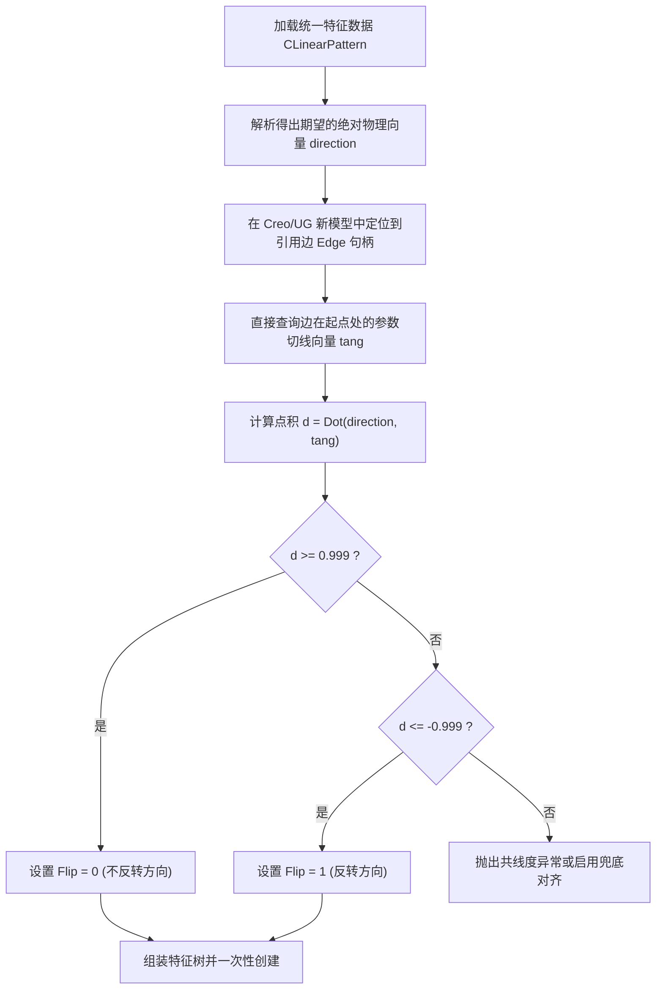

# 三系统阵列特征跨系统参数调研与统一映射设计 (SolidWorks, Creo, UG/NX)

> 调研日期：2026-07-25  
> 系统范围：SolidWorks (SW) API ↔ Creo Pro/Toolkit API ↔ UG/NX (NXOpen) API ↔ CADExchange 统一语义  
> 成果归属：[CADExchange/doc](file:///E:/MyProject/CADExchange/doc)

---

## 1. 跨系统可行性评估与建模范式对照

三维 CAD 系统中的“阵列特征”（包括线性阵列、圆周阵列和镜像）从底层的实现语义来看，主要分为**“独立特征”**与**“特征操作”**两种建模范式。通过设计最小公共特征模型，在这三个系统之间实现完全、无损且对称的数据映射是**完全可行**的。

### 1.1 核心设计差异对照

| 维度 | SolidWorks (SW) | Creo Parametric | UG/NX |
| :--- | :--- | :--- | :--- |
| **特征树角色** | **独立特征**。 作为一个独立的 `IFeature`，通过定义携带的 FeatureData 接口引用一个或多个源特征。 | **对源特征施加的操作**。 阵列并非游离的节点，它必须作用于现存的 Seed Feature。创建后在树上体现为一个“阵列组”（Pattern Group）。 | **独立特征**。 作为一个独立的 `PatternFeature`，通过 Builder 的 `FeatureList` 集合持有并引用被阵列的特征。 |
| **几何拓扑关联** | 支持特征阵列、拓扑面阵列和多实体阵列。通过 SelectionMgr 传递句柄。 | 类似地支持特征、面和体。但在 Toolkit 树中，体阵列通过 `PRO_E_BODY_SELECT` 指定。 | 支持特征阵列、几何体阵列、面阵列。通过独立的 Builder 逻辑或布局分支处理。 |
| **再生解算选项** | `GeometryPattern` （真：仅复制几何体，不重复特征求解；假：每个实例重新解算）。 | `PRO_PATTERN_DIR_REG_VAL` （可控制再生级别：Identical, Similar 等，能达到相同优化目的）。 | `PatternMethod` （`Simple` 相当于几何阵列；`Variational` 重新执行特征解算）。 |

### 1.2 CADExchange 桥接解决策略
* **读取侧 (Read)**：无论哪个系统，读取器都将阵列特征本身提取为独立的统一模型特征（如 `CLinearPattern` 或 `CCircularPattern`），并将其被阵列的源头特征 ID 统一转换为 `seedObjects[0]` 引用。
* **写入侧 (Write)**：
  * **SW 和 UG** 直接分配 Builder 并执行特征插入即可。
  * **Creo** 写入时，必须先根据 `seedObjects[0]` 中记录的统一 ID，定位到已在 Creo 中重建完成的源特征 `ProFeature` 句柄，然后在此句柄上构建元素树，最终调用 `ProPatternCreate` 创建阵列，从而消除范式差异。

---

## 2. 线性阵列字段与参数提取对照表

### 2.1 线性阵列 (Linear Pattern)

| 统一结构属性 (`CLinearPattern`) | SolidWorks API 映射 (`ILinearPatternFeatureData2`) | Creo Element Tree 映射 (`PRO_GENPAT_DIR_DRIVEN`) | UG/NX (NXOpen) 属性 (`LayoutDefinitionLinear`) |
| :--- | :--- | :--- | :--- |
| **`dir1.directionRef`** (方向一几何引用) | `GetDirection1()` (`IEntity`) | `PRO_E_DIRECTION_REFERENCE` (位于 `PRO_E_GENPAT_DIR1` 内) | `Direction1` (`NXOpen::Direction` 引用) |
| **`dir1.direction`** (绝对 3D 物理向量) | 运行时解析：从各实例平移矩阵中利用共线度过滤出来的**归一化物理平移向量**。 | 几何提取：读取边在起点处的切线方向向量 `tang`（依靠 `ProEdgeXYZValGet`）叠加 Flip。 | `Direction1.Vector` (`NXOpen::Vector3d` 归一化) |
| **`dir1.reverse`** (相对反向标志) | `D1ReverseDirection` (bool) | `PRO_E_DIR_PAT_DIR1_FLIP` (0 = 顺切向, 1 = 逆切向) | 矢量点积符号判别 |
| **`dir1.spacing`** (实例间距) | `D1Spacing` （**米 m $\rightarrow$ 统一主单位 mm**） | `PRO_E_GENPAT_DIR1_INC` （**模型主单位，可正负**） | `D1Pitch` 表达式值 |
| **`dir1.count`** (实例总数) | `D1Number` | `PRO_E_GENPAT_FIRST_DIR_NUM_INST` | `D1Count` 表达式值 |
| **`dir2`** (激活标志) | `Direction2` (bool) | `PRO_E_GENPAT_SECOND_DIR_NUM_INST > 1` | `Direction2Enabled` (bool) |
| **`patternSeedOnly`** (仅阵列源) | `D2PatternSeedOnly` | 根据子元素设置映射 | `!PatternAlongDirection1` |
| **`skippedInstances`** (排除项坐标) | `SkippedItemArray` (解析为二维行列网格坐标 `(r, c)`) | `PRO_E_PATTERN_EXCL_LIST` (将一维扁平索引转换为二维坐标) | `PatternService::GetSkippedInstances` |

---

## 3. 圆周阵列字段与参数提取对照表

### 3.1 圆周阵列 (Circular Pattern)

| 统一结构属性 (`CCircularPattern`) | SolidWorks API 映射 (`ICircularPatternFeatureData`) | Creo Element Tree 映射 (`PRO_GENPAT_AXIS_DRIVEN`) | UG/NX (NXOpen) 属性 (`LayoutDefinitionCircular`) |
| :--- | :--- | :--- | :--- |
| **`dir1.axisRef`** (旋转轴几何引用) | `GetAxis()` (`IEntity`) | `PRO_E_GENPAT_AXIS_REF` (位于 `PRO_E_GENPAT_AXIS` 内) | `RotationAxis` 实体引用 |
| **`dir1.direction`** (绝对旋转轴向量) | 运行时解析：从各实例旋转矩阵中解析出的**右手定则物理轴矢量**。 | 几何提取：读取轴几何自带的绝对朝向向量 `dir` (依靠 `ProAxisGeomGet`) 叠加 Flip。 | `RotationAxis.Vector` (`NXOpen::Vector3d`) |
| **`dir1.reverse`** (相对反向标志) | `ReverseDirection` (bool) | `PRO_E_AXIS_PAT_DIR1_FLIP` (0 = 顺手性, 1 = 逆手性) | 旋转轴矢量方向手性判别 |
| **`dir1.spacingType`** (角度分布模式) | `EqualSpacing ? SPAN : PITCH` | 根据 `PRO_E_AXIS_VAL_OPT1` 分支决定 | `AngularSpacing.SpacingType` |
| **`dir1.angle`** (分布/间距角度) | `Spacing` (间距) 或 `TotalAngle` (总角) （**弧度 rad**） | `PRO_E_AXIS_INCR1` (间距) 或 `PRO_E_GENPAT_AXIS_ANG_WHOLE` （**度 deg $\rightarrow$ 统一弧度 rad**） | `AngularPitch` 或 `AngularSpan` （**度 deg $\rightarrow$ 统一弧度 rad**） |
| **`dir1.count`** (角度向实例数) | `TotalInstances` | `PRO_E_GENPAT_DIM_FIRST_DIR_NUM_INST` | `AngularCount` |
| **`dir2`** (径向平移参数) | 启用 `Direction2 == True`，包含 `D2Spacing` | `PRO_E_GENPAT_DIM_SECOND_DIR_NUM_INST > 1` | `RadialCount > 1` 且包含 `RadialPitch` |

---

## 4. 镜像特征字段与参数提取对照表

### 4.1 镜像特征 (Mirror Pattern)

| 统一结构属性 (`CMirrorPattern`) | SolidWorks API 映射 | Creo Element Tree 映射 (`PRO_FEAT_MIRROR`) | UG/NX (NXOpen) 属性 |
| :--- | :--- | :--- | :--- |
| **`mirrorPlaneRef`** (镜像面对称参考) | `GetMirrorPlane()` (`IEntity`) | `PRO_E_MIRROR_PLANE` (`ProSelection`) | `Plane` (`NXOpen::Plane`) |
| **`scope`** (作用域范围) | 根据 `MirrorBodies` 属性决定 (Feature / Body) | 依据元素节点归属判定 (`FEAT_LIST` / `BODY_LIST`) | 区分 `MirrorFeature` 还是 `MirrorBody` |
| **`seedObjects`** (镜像源对象列表) | 解析 `PatternFeatureArray` 或 `PatternBodyArray` | 读取 `PRO_E_MIRROR_FEAT_LIST` 或 `PRO_E_MIRROR_BODY_LIST` | `FeatureList` 或选定镜像体列表 |

---

## 5. 核心几何难点分析与事前判向算法设计

传统阵列回写由于**仅传递相对的 Flip 标志**，在面对跨 CAD 平台转换或几何面拓扑取反时，极易因“参考几何默认方向对调”导致生成完全相反的方向，甚至由于几何体脱离基体造成特征重建失败（Regeneration Failure）。

为达成 100% 稳定的双向无损互转，CADExchange 架构采取了基于**“绝对三维几何真值（Ground Truth）”的事前判向与 Flip 重构算法**。

### 5.1 线性阵列：基于 Edge 切线 API 的事前判向算法
当阵列引用一条几何边时，边的内部参数化起点与终点方向是未知的（在重建阶段甚至可能因为拓扑分裂发生翻转）。

#### Creo 底层切线提取关键 API：
使用 **`ProEdgeXYZValGet(ProEdge edge, double param, ProVector xyz, ProVector tang)`**：
* 传入 `param = 0.0`，此函数会**直接计算出该边在其底层曲线参数化坐标下的归一化切线向量 `tang`**。
* 此 `tang` 向量即为 Creo 认定该边在 `Flip = 0` 时的默认行进方向。
* 写入侧程序无须创建后验证，可以直接通过点积计算提前锁定正确的 `PRO_E_DIR_PAT_DIR1_FLIP` 值。

---

### 5.2 圆周阵列：基于旋转轴向与右手定则的事前判向算法
对于旋转阵列，其默认的旋转手性（顺时针/逆时针）完全取决于参考中心轴向量的方向与右手定则。

1. **提取参考轴的方向向量 `dir`**：
   * 若参考为**基准轴 (Datum Axis)**：通过 `ProAxisGeomGet` 提取绝对方向 `dir`。
   * 若参考为**圆柱面 (Cylinder Surface)**：从 `ProSurfaceDataGet` (对应 `ProCylinderData`) 中获取圆柱中轴方向 `dir`。
2. **手性校验**：
   * 设定统一模型的绝对旋转轴为 $\vec{R}_{expected}$。
   * 计算 $d = \text{Dot}(\vec{R}_{expected}, \vec{dir})$。
   * 若 $d \ge 0.999$，两轴同向，则旋转手性一致，配置 `PRO_E_AXIS_PAT_DIR1_FLIP = 0`。
   * 若 $d \le -0.999$，两轴反向，旋转手性取反，配置 `PRO_E_AXIS_PAT_DIR1_FLIP = 1`（或将旋转角度增量 `INC` 设为负数）。

---

## 6. 参数归一化与单位转换规则

为了保持三端 C++ 读写层交换数据时的绝对严谨，CADExchange 统一模型对基本量做如下归一化处理：

1. **长度单位规整**：
   * **SolidWorks API** 始终以 **米 (m)** 为底输出特征间距。
   * **Creo 和 UG/NX** 底层均采用**当前模型主单位**（如毫米 mm 或英寸 inch）。
   * **归一化规范**：CADExchange 核心模型中的 `spacing` 一律采用 **毫米 (mm)**。读取 SW 特征时，必须进行 $\times 1000.0$ 转换；写入 SW 时进行 $/ 1000.0$ 转换。
2. **角度单位规整**：
   * **SolidWorks API** 读写圆周阵列角度采用 **弧度 (rad)**。
   * **Creo 和 UG/NX** 在界面和底层树中使用 **度 (deg)**。
   * **归一化规范**：CADExchange 模型中的 `angle` 一律采用 **弧度 (rad)**。
     * $\text{Angle}_{rad} = \text{Angle}_{Creo\_Degree} \times \frac{\pi}{180.0}$
     * $\text{Angle}_{Creo\_Degree} = \text{Angle}_{rad} \times \frac{180.0}{\pi}$
3. **跳过实例 (Skipped) 的坐标转换**：
   * **SolidWorks** 的 `SkippedItemArray` 是一维扁平行列坐标数组，如 `[r1, c1, r2, c2]`，代表网格第 r 行第 c 列被跳过。
   * **Creo** 的排除列表 `PRO_E_PATTERN_EXCL_LIST` 是一维序列号 `Idx`。
   * **归一化规范**：统一在 CADExchange 中表达为 `std::vector<CPatternIndex>`（含 `dir1Index, dir2Index`，从 0 开始）。
     * **Creo ↔ CADExchange 转换公式**：
       $$Idx_{Flat} = dir2Index \times dir1Count + dir1Index$$
       利用此公式，读取时将 Creo 的一维 `Idx` 解算为二维坐标，写入时再将二维坐标反向折算为一维 `Idx` 并填充到排除列表中。
