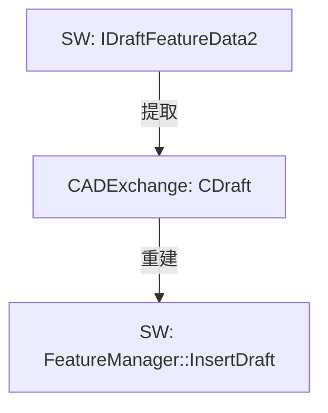
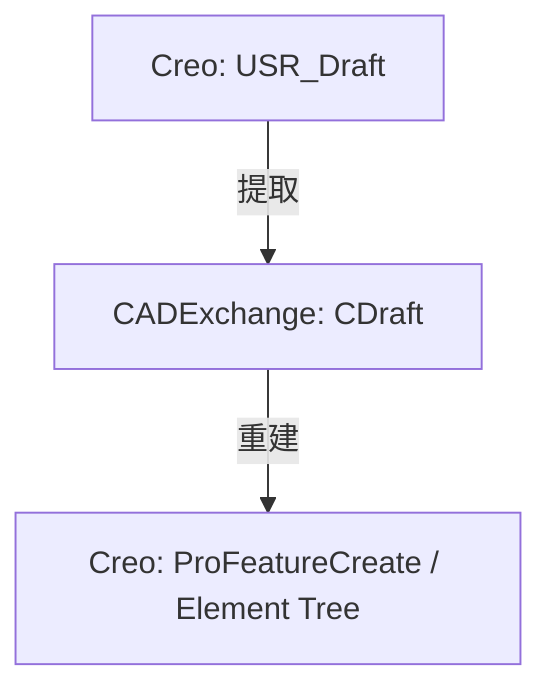

# 拔模特征统一结构设计与 Sw/Creo 双向映射说明

## 1. 概述

拔模特征（Draft / Taper）是注塑、铸造零件设计中常见的面操作类几何特征。为了在 `CADExchange` 中实现 **Creo <-> CADExchange <-> SolidWorks** 的双向高保真转换，本文定义了拔模特征的统一最小标准结构 `CDraft`，并详细说明了其与 SolidWorks 和 Creo 之间的提取（Read）与重建（Write）映射规则。

在 `CADExchange::FeatureType` 中增加：
- `FeatureType::Draft` (对应 `CDraft` 结构体)

---

## 2. CDraft 统一结构定义与字段释义

在 [UnifiedFeatures.h](file:///D:/CADHHU/CADProj/CADExchange/core/UnifiedFeatures.h) 中定义的 `CDraft` 核心结构如下：

```cpp
namespace CADExchange {

/**
 * @brief 拔模类型枚举。
 */
enum class DraftType {
  Unknown = 0,
  NeutralPlane,          ///< 中性面拔模 (SW: Neutral Plane, Creo: Hinge == PLANE)
  PartingLine,           ///< 分型线拔模 (SW: Parting Line, Creo: Hinge == CURVE)
  Step                   ///< 台阶拔模 (SW: Step Draft)
};

/**
 * @brief 拔模特征台阶过渡类型。
 */
enum class DraftStepType {
  None = 0,
  Tapered,               ///< 锥形台阶 (SW: swDraftTaperedStep)
  Perpendicular          ///< 垂直台阶 (SW: swDraftPerpendicular)
};

/**
 * @brief 拔模分割模式。
 */
enum class DraftSplitMode {
  None = 0,              ///< 不分割 (Creo: SPLIT_NONE)
  Neutral,               ///< 根据中性面/分型线分割 (Creo: SPLIT_NEUTRAL)
  Surface,               ///< 根据参考平面/曲面分割 (Creo: SPLIT_SURF)
  Sketch                 ///< 根据分割草图分割 (Creo: SPLIT_SCTCH)
};

/**
 * @brief 拔模特征 (Draft)。
 */
struct CDraft : public CFeatureBase {
  // ================= 核心最小标准字段 =================
  
  DraftType draftType{DraftType::Unknown};                  ///< 拔模方式
  
  std::shared_ptr<CRefEntityBase> pullDirectionRef;        ///< 拔模/拉伸开模方向参考（基准面/轴/边/面）
  bool reversePullDirection = false;                        ///< 拉伸方向反向控制

  std::vector<std::shared_ptr<CRefFace>> draftFaces;        ///< 被拔模的目标面集合
  
  std::shared_ptr<CRefEntityBase> neutralPlaneRef;         ///< 中性面参考（仅中性面拔模使用）
  
  std::vector<std::shared_ptr<CRefEntityBase>> partingLines; ///< 分型线参考集合（分型线/台阶拔模使用）
  
  double draftAngle = 0.0;                                  ///< 第一侧拔模角度（弧度制）

  // ================= 双侧与分割扩展字段 =================
  
  bool isTwoSided = false;                                  ///< 是否为双侧/双向拔模
  double draftAngleSide2 = 0.0;                             ///< 第二侧拔模角度（弧度制）
  
  DraftSplitMode splitMode{DraftSplitMode::None};           ///< 分割模式
  std::shared_ptr<CRefEntityBase> splitGeometryRef;        ///< 分割参考实体（分割平面/曲面/草图）
  
  DraftStepType stepType{DraftStepType::None};              ///< 台阶过渡类型（台阶拔模专属）
  
  bool includeTangent = false;                              ///< 切线传播控制（包含切向面）

  CDraft() { featureType = FeatureType::Draft; }
};

} // namespace CADExchange
```

### 字段详细释义表

| 字段名 | 类型 | 对应物理意义 | 最小转换要求 |
| :--- | :--- | :--- | :--- |
| `draftType` | `DraftType` | 拔模定位与旋转基准类别 | **核心**，决定三端各自走何种 API 创建分支 |
| `pullDirectionRef` | `shared_ptr<CRefEntityBase>` | 模具开启或拔出时的拉伸方向 | **核心**，通常是基准面/平面（法向）或基准轴/边（切向） |
| `reversePullDirection` | `bool` | 控制拔模旋转的初始法向偏置 | **核心**，必须严格映射以避免倾斜方向相反 |
| `draftFaces` | `vector<shared_ptr<CRefFace>>` | 发生形变的倾斜面 | **核心**，两端必须严格搜集并传回 |
| `neutralPlaneRef` | `shared_ptr<CRefEntityBase>` | 中性截面（在该面上的被拔模线宽不变） | 中性面拔模时必填 |
| `partingLines` | `vector<shared_ptr<CRefEntityBase>>` | 分型折弯边界线 | 分型线与台阶拔模时必填，通常映射到模型边线/基准曲线 |
| `draftAngle` | `double` | 主侧拔模倾斜角度 | **核心**，C++层内部统一使用弧度制保存，转换为 CAD 原生度数 |
| `isTwoSided` | `bool` | 是否在分型/中性双侧同时倾斜 | 涉及分割或双向分型线时有效 |
| `draftAngleSide2` | `double` | 第二侧拔模倾斜角度 | `isTwoSided` 为 true 且独立配置时有效 |
| `splitMode` | `DraftSplitMode` | 控制拔模面是否在基准面/线处发生折断 | 映射 Creo 的 Split 与 SW 的双向分型面拔模 |
| `splitGeometryRef` | `shared_ptr<CRefEntityBase>` | 用于分割的曲面或面 | 当 `splitMode` 为 `Surface` 时有效 |
| `stepType` | `DraftStepType` | 分型线上两侧过渡面切除的过渡类型 | SW 台阶拔模专用，Creo 可用 Extend 补偿 |
| `includeTangent` | `bool` | 是否在选择单个面时自动将共面切向面计入 | 仅影响建模时的搜集交互，通常提取为布尔值 |

### 2.2 CDraft 字段与 SW/Creo 双向映射对照表

以下是 `CADExchange::CDraft` 统一结构中的字段与 SolidWorks `IDraftFeatureData2` 的属性及 Creo `USR_Draft` 结构体的双向映射关系对照：

| CADExchange 字段名 | SolidWorks 对应属性 / 接口属性 | Creo 对应结构字段 / Element | 映射转换规则说明 |
| :--- | :--- | :--- | :--- |
| `draftType` | `GetType()` (`swDraftType_e`) | `Draft_Side1.Draft_Hinge_Type` | `NeutralPlane` $\leftrightarrow$ `swNeutralPlaneDraft` (0) / `PLANE` (1)<br>`PartingLine` $\leftrightarrow$ `swPartingLineDraft` (1) / `CURVE` (2)<br>`Step` $\leftrightarrow$ `swStepDraft` (2) / (Creo 用 `Split` 分割模拟) |
| `pullDirectionRef` | `DirectionPull` | `DraftDirection.Dir_Reference` | 拔模/拉伸开模方向的实体引用（面/基准轴/边等） |
| `reversePullDirection` | `ReverseDirection` | `DraftDirection.Dir_Flip` | 翻转开模方向。SW 的 `VARIANT_TRUE`/`VARIANT_FALSE` $\leftrightarrow$ Creo 的 `1`/`0` |
| `draftFaces` | `FacesToDraft` / `GetFacesToDraft` | `DraftSurface` | 被拔模的目标表面集合 |
| `neutralPlaneRef` | `NeutralPlane` | `Draft_Side1.Draft_Hinge` (HingeType 为 PLANE) | 中性面基准引用。非中性面拔模时置空 |
| `partingLines` | `PartingLines` / `GetPartingLines` | `Draft_Side1.Draft_Hinge` (HingeType 为 CURVE) | 分型线参考集合（通常在分型线/台阶拔模时映射到模型边缘/曲线） |
| `draftAngle` | `Angle` | `Draft_Side1.Draft_Angle_Constant` | 第一侧/主侧拔模角。统一使用弧度，SW 与 Creo 使用度数，需进行 `弧度 $\leftrightarrow$ 角度` 双向换算 |
| `isTwoSided` | 隐式控制（分型线双向或台阶两侧） | `Split != PRO_DRAFT_UI_SPLIT_NONE` | 标识是否存在双侧独立或依赖拔模 |
| `draftAngleSide2` | 分型线两侧不同的第二侧角度值 | `Draft_Side2.Draft_Angle_Constant` | 第二侧/反向拔模角数值，若为单侧或非分割模式则置零 |
| `splitMode` | 隐式由分型线双侧控制 | `Split` (`PRO_DRAFT_SPLIT_MODE`) | 拔模分割模式：`None`/`Neutral`/`Surface`/`Sketch` 三端转换适配 |
| `splitGeometryRef` | 无原生映射（依靠双侧几何位置隐式表达）| `Split_Geom` (CURVE/SURF) 或 `Split_Sketch` | 用于分割拔模的参考平面、曲面或草绘投影引用 |
| `stepType` | `StepType` (`swDraftStepType_e`) | 无（由 `PRO_DRAFT_EXTEND` 延伸属性模拟）| 过渡台阶样式：`Tapered` (0) 或 `Perpendicular` (1) |
| `includeTangent` | `FacePropagation` | `Include_Tangent` | 切线传播控制。SW 的 `swFacePropTangent` $\leftrightarrow$ Creo 的布尔标志 |


### 2.3 两系统完全通用最小标准结构 (CDraftCommon)

为了方便在进行双端无损或极简转换时使用，我们可以将上述完整的 `CDraft` 进行提炼，独立出一个**两系统均能完美原生支持的最小标准结构子集**（例如 `CDraftCommon`）。该结构不包含任何平台专有的高级控制项（如分割草图、台阶类型、选择传播等），只体现纯粹的拔模几何边界。

```cpp
namespace CADExchange {

/**
 * @brief 两系统通用最小标准拔模结构。
 * 
 * 仅包含 SolidWorks 和 Creo 均能原生、无损支持的几何特征参数。
 */
struct CDraftCommon {
  // 1. 拔模定位类别（仅限中性面和分型线，台阶拔模不计入）
  DraftType draftType{DraftType::Unknown};                  
  
  // 2. 开模拉伸方向
  std::shared_ptr<CRefEntityBase> pullDirectionRef;        
  bool reversePullDirection = false;                        

  // 3. 被拔模的拓扑面集合（数据读取的最终面集）
  std::vector<std::shared_ptr<CRefFace>> draftFaces;        
  
  // 4. 基准定位参考
  std::shared_ptr<CRefEntityBase> neutralPlaneRef;          ///< 中性面参考 (用于中性面拔模)
  std::vector<std::shared_ptr<CRefEntityBase>> partingLines; ///< 分型线参考 (用于分型线拔模)
  
  // 5. 倾斜角参数
  double draftAngle = 0.0;                                  ///< 主要侧拔模角
  bool isTwoSided = false;                                  ///< 是否为双侧拔模
  double draftAngleSide2 = 0.0;                             ///< 第二侧拔模角 (isTwoSided为true时有效)
};

} // namespace CADExchange
```

#### 通用最小标准结构的特点与映射共识：
1. **类型范围收敛**：`draftType` 仅包含 `NeutralPlane`（中性面）与 `PartingLine`（分型线）两种类型。SW 的 `Step` 模式由于在 Creo 端需要进行繁琐几何缝合，不属于“无损通用子集”。
2. **双侧语义对齐**：当 `isTwoSided` 为 `true` 时，在 SW 端直接映射为分型线拔模的 Direction 1 / Direction 2 双向配置；在 Creo 端映射为默认的 `Split = SPLIT_NEUTRAL`（根据中性面/分型线分割）且两侧角度独立配置。这在两端均为原生、对称的几何实现，转换完全无损。
3. **摒弃交互与拟合字段**：删除了 `includeTangent`（由前置面列表完全接管）、`splitGeometryRef`（避开 Creo 专属的复杂分割体）以及 `stepType`（避开 SW 专有的过渡台阶类型）。

---


## 3. SolidWorks 提取 (Read) 与创建 (Write) 映射规则

SW 对应的数据接口为 `IDraftFeatureData2`，通过 `swconst.tlh` 中定义的 `swDraftType_e` 控制类型。



### 3.1 从 SolidWorks 提取到 CDraft (Read)

1. **类型映射 (`draftType`)**：
   - 读取 `IDraftFeatureData2::GetType`：
     - 若为 `swNeutralPlaneDraft` (0)，设置 `draftType = DraftType::NeutralPlane`。
     - 若为 `swPartingLineDraft` (1)，设置 `draftType = DraftType::PartingLine`。
     - 若为 `swStepDraft` (2)，设置 `draftType = DraftType::Step`。
2. **方向映射 (`pullDirectionRef` & `reversePullDirection`)**：
   - 读取 `IDraftFeatureData2::DirectionPull` 并将其转换包装为 `CRefEntityBase`，存入 `pullDirectionRef`。
   - 读取 `IDraftFeatureData2::ReverseDirection` (VARIANT_BOOL)，赋值给 `reversePullDirection`。
3. **被拔模面映射 (`draftFaces`)**：
   - 通过 `IDraftFeatureData2::GetFacesToDraft` 提取实体指针数组，依次转换包装为 `CRefFace` 存入 `draftFaces`。
4. **参考特征映射 (`neutralPlaneRef` & `partingLines`)**：
   - 若为中性面拔模：读取 `IDraftFeatureData2::NeutralPlane` 转换为引用，存入 `neutralPlaneRef`。
   - 若为分型线或台阶拔模：读取 `IDraftFeatureData2::GetPartingLines`（边/曲线数组）转换为 `CRefEntityBase` 链，存入 `partingLines`。
5. **角度与台阶映射 (`draftAngle` & `stepType`)**：
   - 读取 `IDraftFeatureData2::Angle` (弧度值/度数转弧度)，存入 `draftAngle`。
   - 若为台阶拔模：读取 `IDraftFeatureData2::StepType`：
     - 若为 `swDraftTaperedStep` (0)，设置 `stepType = DraftStepType::Tapered`。
     - 若为 `swDraftPerpendicular` (1)，设置 `stepType = DraftStepType::Perpendicular`。
6. **额外配置**：
   - 读取 `IDraftFeatureData2::FacePropagation`，若其为 `swFacePropTangent` 以外的值，则 `includeTangent = false`；若为切向传播则为 `true`。

### 3.2 从 CDraft 重建到 SolidWorks (Write)

根据 `CDraft::draftType` 的不同，SW 在通过 `FeatureManager::InsertDraft` 或 `IDraftFeatureData2` 创建特征时配置不同的属性：

- **第一步：基础参数注入**：
  - 创建拔模数据对象。设置拉伸方向为 `pullDirectionRef`，配置 `ReverseDirection`。
  - 将 `draftFaces` 中的几何面逐一添加到选择集。
  - 根据 `includeTangent` 配置 `FacePropagation` 为 `swFacePropTangent` 或 `swFacePropNone`。
- **第二步：根据模式分支处理**：
  - **NeutralPlane 分支**：
    - 设置拔模数据类型为 `swNeutralPlaneDraft`。
    - 将 `neutralPlaneRef` 分配给中性面参数。
    - 设置主要角度为 `draftAngle` (度数制)。
  - **PartingLine 分支**：
    - 设置拔模数据类型为 `swPartingLineDraft`。
    - 将 `partingLines` 中的边添加至分型线选择集中。
    - 若 `isTwoSided` 为 true，需要在分型线上分别配置 Direction 1 Angle (`draftAngle`) 和 Direction 2 Angle (`draftAngleSide2`)。
  - **Step 分支**：
    - 设置拔模数据类型为 `swStepDraft`。
    - 将 `partingLines` 注入分型线选择集。
    - 根据 `stepType` 设置 `StepType` 属性 (`swDraftTaperedStep` / `swDraftPerpendicular`)。

---

## 4. Creo 提取 (Read) 与创建 (Write) 映射规则

Creo 中拔模由 `PRO_FEAT_DRAFT` 承载。提取与创建的上下文结构体对应 demo 代码中的 `USR_Draft` 结构。



### 4.1 从 Creo 提取到 CDraft (Read)

Creo 使用铰链类型与分割模式的交叉映射：
1. **模式映射 (`draftType`)**：
   - 读取主侧铰链属性 `Draft_Side1.Draft_Hinge_Type`：
     - 若为 `PRO_DRAFT_HINGE_PLANE` (中性面)，设置 `draftType = DraftType::NeutralPlane`。
     - 若为 `PRO_DRAFT_HINGE_CURVE` (分型线) 或 `PRO_DRAFT_HINGE_QUILT`，设置 `draftType = DraftType::PartingLine`。
2. **方向与目标面映射**：
   - 读取 `DraftDirection.Dir_Reference` 存入 `pullDirectionRef`。
   - 读取 `DraftDirection.Dir_Flip` 映射为 `reversePullDirection`。
   - 读取整个面集合 `DraftSurface` 存入 `draftFaces`。
3. **几何参考映射**：
   - 若 `draftType == DraftType::NeutralPlane`：读取 `Draft_Side1.Draft_Hinge` 存入 `neutralPlaneRef`。
   - 若 `draftType == DraftType::PartingLine`：读取 `Draft_Side1.Draft_Hinge` 或是 `CurveCollection` 的曲线引用，存入 `partingLines`。
4. **分割与双侧提取 (`splitMode` & `isTwoSided` & `draftAngleSide2`)**：
   - 读取全局 `Split` 模式：
     - `PRO_DRAFT_UI_SPLIT_NONE` (0) -> `splitMode = DraftSplitMode::None`
     - `PRO_DRAFT_UI_SPLIT_NEUTRAL` (1) -> `splitMode = DraftSplitMode::Neutral`
     - `PRO_DRAFT_UI_SPLIT_SURF` (2) -> `splitMode = DraftSplitMode::Surface`
     - `PRO_DRAFT_UI_SPLIT_SCTCH` (3) -> `splitMode = DraftSplitMode::Sketch`
   - 若 `Split != PRO_DRAFT_UI_SPLIT_NONE`，说明存在分割面，开启 `isTwoSided = true`。此时：
     - 读取 `Draft_Side2.Draft_Angle_Constant` 赋值给 `draftAngleSide2`。
     - 若存在 `Split_Geom` 或 `Split_Sketch`，将其转换包装存入 `splitGeometryRef`。
5. **角度与切线**：
   - 读取 `Draft_Side1.Draft_Angle_Constant` 存入 `draftAngle`（Creo API 通常以度为单位读取，需根据模型单位要求进行度/弧度标定）。
   - 读取 `Include_Tangent` 标志映射至 `includeTangent`。

### 4.2 从 CDraft 重建到 Creo (Write)

在 Creo 侧重建主要是根据 `CDraft` 填充 Element Tree，以符合 `ProFeatureCreate` 的输入格式：

1. **配置面集合与拉伸方向**：
   - 将 `draftFaces` 转换为 `ProSelection` 集合，注入 `PRO_DRAFT_SURFACES` 元素中。
   - 将 `pullDirectionRef` 分配给 `PRO_DRAFT_DIRECTION` 元素，`reversePullDirection` 映射为 flip 数值（`PRO_DRAFT_DIR_FLIP`）。
2. **配置铰链线与拔模类型**：
   - 若 `draftType == DraftType::NeutralPlane`：
     - 设置 Hinge 1 类型为 `PRO_DRAFT_HINGE_PLANE`，铰链实体分配 `neutralPlaneRef`。
   - 若 `draftType == DraftType::PartingLine` 或 `DraftType::Step`：
     - 设置 Hinge 1 类型为 `PRO_DRAFT_HINGE_CURVE`，铰链链实体分配 `partingLines`。
3. **分割模式处理**：
   - 将 `splitMode` 映射为 `PRO_DRAFT_SPLIT_MODE`（NONE / NEUTRAL / SURF / SCTCH）。
   - 若 `splitMode` 为 `Surface` 或 `Sketch`，将分割几何 `splitGeometryRef` 分配给 `PRO_DRAFT_SPLIT_GEOM` 或分割草图元素。
4. **多侧角度写入**：
   - 写入 `PRO_DRAFT_CONST_VAR` 始终为常角模式 (`PRO_DRAFT_CONST`)。
   - 写入 Side 1 常角值为 `draftAngle`（弧度转度）。
   - 若 `isTwoSided` 为 true，设置 Side 2 的常角值为 `draftAngleSide2`。设置 `PRO_DRAFT_HINGE_DEP` 为 `PRO_DRAFT_DEP_IND`（若两角度不同）或 `PRO_DRAFT_DEP_DEP`（若两角度相同）。

---

## 5. 两系统核心转换与边界对齐策略

在 Creo 与 SolidWorks 的互相转换中，有一些由于 CAD 建模内核机制不同导致的差异。我们需要在 CADExchange 层实施以下**边界补偿或降级对齐策略**：

### 5.1 台阶拔模 (Step Draft) 降级对齐
- **SW -> Creo**：SW 的台阶拔模通过将 `CDraft::draftType = DraftType::Step` 读入。映射到 Creo 重建时，由于 Creo 无原生 Step 选项，我们将类型降级为 `PRO_FEAT_DRAFT`，且将 `Split` 设置为 `PRO_DRAFT_UI_SPLIT_NEUTRAL` 分割方式，配置 Hinge 2 保持一致，并在参数写入中通过 `PRO_DRAFT_EXTEND = PRO_DRAFT_EXT_BOTH`（双侧延伸截交）来保证几何的物理过渡一致。
- **Creo -> SW**：若 Creo 的 `Split` 不为 None，且双侧存在错位，在 SW 端无法直接生成普通的单中性面拔模。应重建为 `swStepDraft`（台阶拔模），并将过渡类型默认指定为垂直台阶（`swDraftPerpendicular`）完成过渡。

### 5.2 变角拔模 (Variable Draft) 退化对齐
- 由于 SolidWorks 的 `IDraftFeatureData2` 原生仅支持输入一个 `Angle` 属性，无法指定变角点。
- **Creo -> SW**：当在 Creo 端检测到变角拔模（`Constant_or_Variable == PRO_DRAFT_VAR`）时，读取其 `Angles_Pnt` 点列，并提取所有端点拔模角的**数学平均值**。在 CADExchange 的 `draftAngle` 写入此平均值，并在转换落盘日志中输出 `[Warning] Variable Draft is deprecated to Constant Draft using average angle during SW reconstruction.`。
- **SW -> Creo**：SW 的单角度直接映射为 Creo 的常值角拔模即可。

### 5.3 切线传播策略对齐
- SW 的 `FacePropagation` 有多个枚举，而 Creo 只支持 `Include_Tangent`（是否包含切向面）。
- 转换时采取逻辑收敛：如果 SW 读取的传播类型为 `swFacePropTangent`，映射到 CADExchange 的 `includeTangent = true`；否则均视为 `false`。这在写入 Creo 时直接对应布尔标志。

---

## 6. XML 序列化与校验门配置

### 6.1 XML 节点规划
为了在 [TinyXMLSerializer](file:///D:/CADHHU/CADProj/CADExchange/service/serialization/TinyXMLSerializer.cpp) 中支持落盘：
```xml
<Feature type="Draft" id="FB-5" name="Draft_1">
    <DraftType>NeutralPlane</DraftType>
    <PullDirection>
        <RefEntity type="RefFace" parentFeatureID="FB-2" topoIndex="3"/>
    </PullDirection>
    <ReversePullDirection>false</ReversePullDirection>
    <DraftFaces>
        <RefEntity type="RefFace" parentFeatureID="FB-2" topoIndex="1"/>
        <RefEntity type="RefFace" parentFeatureID="FB-2" topoIndex="2"/>
    </DraftFaces>
    <NeutralPlane>
        <RefEntity type="RefFace" parentFeatureID="FB-2" topoIndex="3"/>
    </NeutralPlane>
    <DraftAngle>0.087266</DraftAngle> <!-- 弧度，对应5度 -->
    <IsTwoSided>false</IsTwoSided>
    <SplitMode>None</SplitMode>
    <IncludeTangent>true</IncludeTangent>
</Feature>
```

### 6.2 校验门规则 (ModelValidator)
在 [ModelValidator.cpp](file:///D:/CADHHU/CADProj/CADExchange/service/validation/ModelValidator.cpp) 中添加对 Draft 特征的校验：
- **Error (阻断错误)**：
  - 缺少 `pullDirectionRef`（拉伸方向未定义）。
  - `draftFaces` 数组为空。
  - `draftType` 为 `NeutralPlane` 时，`neutralPlaneRef` 为空。
  - `draftType` 为 `PartingLine` 或 `Step` 时，`partingLines` 数组为空。
- **Warning (警告)**：
  - `draftAngle` 的数值超出正常模具设计区间（例如大于 45 度或小于 0 度）。
